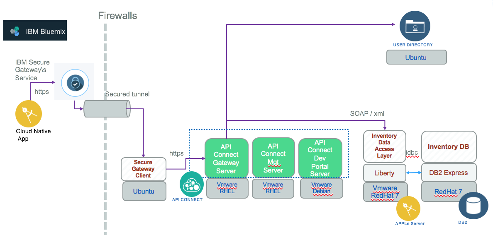

# Inventory Integration API

This project is part of the 'IBM Integration Reference Architecture' suite, available at [https://github.com/ibm-cloud-architecture/refarch-integration](https://github.com/ibm-cloud-architecture/refarch-integration)

## Goals
The API definition exposes a set of RESTful services for managing a product inventory. The API is defined and run on on-premise servers but exposed via secure connection to public cloud so born on cloud applications, like the simple [inventory app](https://github.com/ibm-cloud-architecture/refarch-inventory-app), can leverage those APIs.

## Architecture
As illustrated in the figure below, the Inventory database is not directly accessed by application who needs it, but via a SOA service data access layer developed with JAXWS.

The SOAP interface needs to be mapped to REST api, and using a API economy paradigm, this API will become a product for the CASE Inc IT team.

## How the SOAP interface was mapped to API
In order to map the SOAP service to a REST api, we followed the following steps:
1) create a REST API in the API Manager UI (see tutorial here: https://www.ibm.com/support/knowledgecenter/SSMNED_5.0.0/com.ibm.apic.apionprem.doc/tutorial_apionprem_expose_SOAP.html)
2) Import the WSDL for the SOAP service in the "Services" component. This is basically an import from either a file or an url. We used the url option by pointing the dialog to http://172.16.254.44:9080/inventory/ws?WSDL.
3) Create an assembly for each of the supported REST operations:
          title: operation-switch
          case:
            - operations:
                - verb: get
                  path: /items
            - operations:
                - verb: get
                  path: '/item/{itemId}'
            - operations:
                - verb: post
                  path: /items
            - operations:
                - verb: put
                  path: '/item/{itemId}'
            - operations:
                - verb: delete
                  path: '/item/{itemId}'
for each of these operations, there is a generated map and a invoke created by the import of the WSDL. You need to find the operation map that corresponds to the REST operation you are implementening and drop it on the canvas. But first you must define the "path" that corresponds to the SOAP operation. So for example, to implement GET /items REST API, you would need to define a "Path" for "/items" first. Go over to the "assembly" tab, you'll see a default invoke policy has been defined for you for the GET /items path - delete it by hovering over the policy untill a few icons appear on top of the policy. Click omn the trash can icon to delete. In the assembly tab of the API Manager UI, you'll see a whole bunch of operations at the left hand bottom portion of the screen. Select "items" and drag it to the canvas. It should now look like this:
map(items:input)->invoke(items:invoke)->map(items:output)
see the completed yaml here: https://github.com/ibm-cloud-architecture/refarch-integration-api/blob/master/apiconnect/sample-inventory-api_1.0.0.yaml

## Security

## Continuous Integration
Reusing the devops approach as descrive in [this asset](https://github.com/ibm-cloud-architecture/refarch-hybridcloud-blueportal-api/blob/master/HybridDevOpsForAPIC.pdf) ....

## How to leverage this asset
