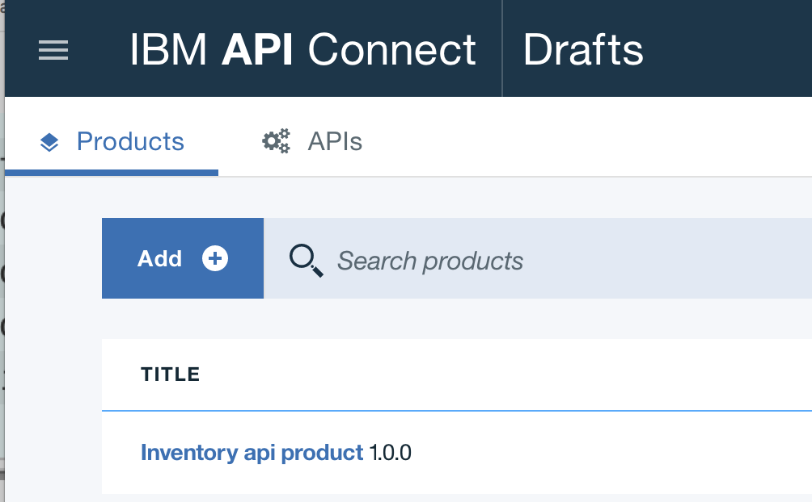
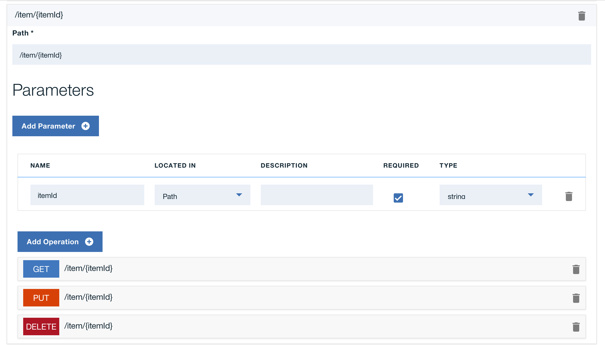
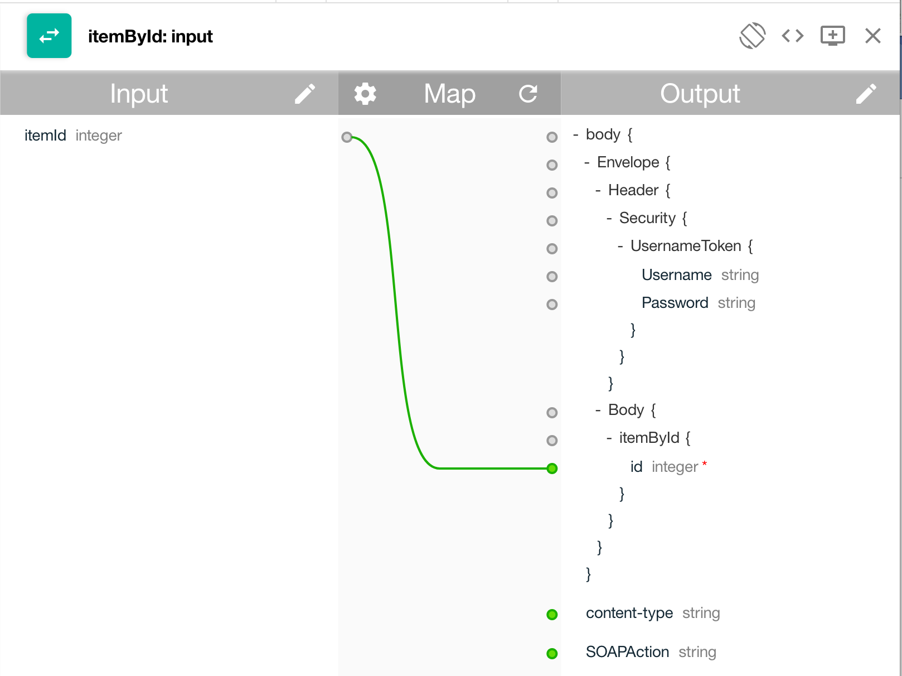
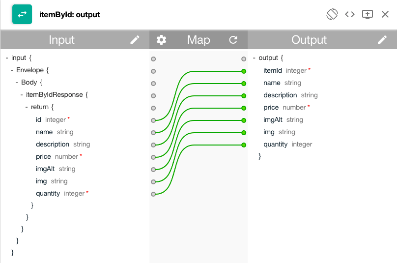

# Inventory APIs

This project is part of the 'IBM Hybrid Integration Reference Architecture' suite, available at [https://github.com/ibm-cloud-architecture/refarch-integration](https://github.com/ibm-cloud-architecture/refarch-integration) and address how we define an API product with IBM API Connect to integrate an existing SOA service for inventory management.

## Table of Contents
* [Goals](https://github.com/ibm-cloud-architecture/refarch-integration-api#goals)
* [Architecture](https://github.com/ibm-cloud-architecture/refarch-integration-api#architecture)
* [Server configuration](https://github.com/ibm-cloud-architecture/refarch-integration-api#server-configuration)
*[Interface Mapping](https://github.com/ibm-cloud-architecture/refarch-integration-api#how-the-soap-interface-was-mapped-to-restful-api)
*[Security](https://github.com/ibm-cloud-architecture/refarch-integration-api#security)
*[CI/CD]()
*[Monitoring]()
*[Compendium](https://github.com/ibm-cloud-architecture/refarch-integration-api#compendium)

## Goals
This project includes the definition for the inventory APIs used by the cloud native app, CASE Inc Portal, and the *blue compute* micro service and a set of guidance on how servers are configured and API definitions are done. We also detail security setting end to end.

The API definition exposes a set of RESTful services for managing a product inventory.
  

The API is defined and run on on-premise servers but exposed via secure connection to public cloud so born on cloud applications, like the simple [inventory app](https://github.com/ibm-cloud-architecture/refarch-caseinc-app), can leverage those APIs.

## Architecture
As illustrated in the figure below, the Inventory database is not directly accessed by application who needs it, but via a data access layer, SOA service, developed in Java using JAXWS and deployed on WebSphere Liberty server.

  

With new programming model to consume RESTful API, existing SOAP interfaces need to be mapped to RESTful apis, and using a API economy paradigm, those APIs will become a product managed by IBM API connect. The *CASE Inc IT team* wants to cover their cost and exposing API may generate a revenue stream, so they defined a new API for inventory management.

Born on Bluemix web apps or micro services access the exposed RESTful API using a Bluemix Secure Gateway service, which supports the API Connect destination definition. For detail on how the secure gateway was configured see [note](https://github.com/ibm-cloud-architecture/refarch-integration-utilities/blob/master/docs/ConfigureSecureGateway.md)

The diagram below presents the item/{itemid} URL as defined in API Connect and that can be accessed via the secure gateway with a URL like: https://cap-sg-prd-5.integration.ibmcloud.com:16582/csplab/sb/sample-inventory-api/item/180   



Here is an example of basic nodejs call that validates the integration is working:
```javascript
var options={
  url: 'https://cap-sg-prd-5.integration.ibmcloud.com:16582/csplab/sb/sample-inventory-api/items',
  hostname: 'cap-sg-prd-5.integration.ibmcloud.com',
  port: 16582,
  path: '/csplab/sb/sample-inventory-api/items',
  method: 'GET',
  rejectUnauthorized: true,
  headers: {
    'X-IBM-Client-Id': "5d2a6edb-793d-4193-b9b0-0a087ea6c123",
    'accept': 'application/json',
    'Authorization': 'Bearer '+token
  }
}
var req=request.get(
    options,
    function (error, response, body) {
    });
```

## Server configuration
A non-high availability installation consists of installing 3 virtual servers: Management (mgmt), Portal, DataPower(DP) and gateway. To support high availability, a cluster installation just adds more servers, but the basic installation is the same. To achieve high availability you’ll need at a minimum 2 mgmt servers, 2 DataPower appliances, and 3 Portal servers.
The configuration decision was to use only one server so we can quickly test resiliency and error reporting. The goal of *Brown compute* is not to validate on-premise HA, but more on the hybrid side.

After the virtual OVA files are loaded, then you can refer here for each configuration:
1. Mgmt -
https://www.ibm.com/support/knowledgecenter/en/SSMNED_5.0.0/com.ibm.apic.install.doc/overview_installing_mgmtvm_apimgmt.html
2. DP -
https://www.ibm.com/support/knowledgecenter/en/SSMNED_5.0.0/com.ibm.apic.install.doc/overview_installing_gatewayvm_apimgmt.html
3. Portal -
https://www.ibm.com/support/knowledgecenter/en/SSMNED_5.0.0/com.ibm.apic.install.doc/tapim_portal_installing_VA.html


## How the SOAP interface was mapped to RESTful API
In order to map the SOAP service to a REST api, we followed the following steps:  
1) Using the API Manager, create a REST API (see tutorial here: https://www.ibm.com/support/knowledgecenter/SSMNED_5.0.0/com.ibm.apic.apionprem.doc/tutorial_apionprem_expose_SOAP.html)
 a- Add a new product
2) Import the WSDL for the SOAP service in the "Services" component. This is basically an import from either a file or an url. We used the url option by pointing to on-premise WebSphere Liberty server URL: http://172.16.254.44:9080/inventory/ws?WSDL.
3) Create an assembly for each of the supported REST operations:

```
          title: operation-switch
          case:
            - operations:
                - verb: get
                  path: /items
            - operations:
                - verb: get
                  path: '/item/{itemId}'
            - operations:
                - verb: post
                  path: /items
            - operations:
                - verb: put
                  path: '/item/{itemId}'
            - operations:
                - verb: delete
                  path: '/item/{itemId}'
```


 For each of these operations, there is a generated map and a `invoke` created by the import of the WSDL. You need to find the operation map that corresponds to the REST operation you are implementing and drop it on the canvas.

 But first you must define the "url-path" that corresponds to the SOAP operation.  
 For example, to implement GET /items REST API, you would need to define a "Path" for "/items" first. Go over to the "assembly" tab, you'll see a default invoke policy has been defined for you for the GET /items path - delete it by hovering over the policy until a few icons appear on top of the policy. Click on the trash icon to delete. In the assembly tab of the API Manager UI, you'll see a whole bunch of operations at the left hand bottom portion of the screen. Select "items" and drag it to the canvas. It should now look like this:
map(items:input)->invoke(items:invoke)->map(items:output)

For a get item by id the pattern is the same as illustrated in the image below:
 
 The invoke is a SOAP request (a HTTP POST)
Using the REST input parameter, itemId, we need to use it for the SOAP request itemById.id element.:


The following diagram illustrates a mapping from the SOAP response of the itemById to the JSON document of the /item/{itemId} which is part of the new exposed API.




See the completed yaml here: https://github.com/ibm-cloud-architecture/refarch-integration-api/blob/master/apiconnect/sample-inventory-api_1.0.0.yaml

## Security
The connection between the external application and API Connect Gateway is using TSL. For production environment you need to get a certificate from a certificate agency with the hostname of the API gateway server you deploy to. This certificate is used in IBM Secure gateway and any client code that needs to access the new exposed API. See the deep dive article on [TLS for Brown compute](https://github.com/ibm-cloud-architecture/refarch-integration/blob/master/docs/TLS.md)

## Continuous Integration
Reusing the devops approach as describe in [this asset](https://github.com/ibm-cloud-architecture/refarch-hybridcloud-blueportal-api/blob/master/HybridDevOpsForAPIC.pdf) ....

## How to leverage this asset
Using your own IBM API Connect instance import the [yaml](https://github.com/ibm-cloud-architecture/refarch-integration-api/blob/master/apiconnect/sample-inventory-api_1.0.0.yaml) delivered in this project.

## Compendium
* [API Connect product documentation](https://www.ibm.com/support/knowledgecenter/en/SSMNED_5.0.0/mapfiles/getting_started.html)
* [Developer center](https://developer.ibm.com/apiconnect/)
