Enabling IBM API Connect on IBM Cloud Private Version 3.1
=========================================================

# Introduction

This document provides guidance for installing **IBM API Connect v2018.4.1** on **IBM Cloud Private Version 3.1**. Also, it covers the topic of using all the components of IBM API Connect and tips for troubleshooting issues.

This document presumes that following two main pre-requisites are completed in the environment. 

* Setting up IBM Cloud Private cluster

  + [Install and Configure IBM Cloud Private cluster](https://www.ibm.com/support/knowledgecenter/en/SSBS6K_3.1.0/installing/install_containers.html)

* Setting up storage for IBM API Connect 

  + [Install and Configure Ceph on IBM Cloud Private](./Install%20Ceph%20for%20ICP.md)  

Once the pre-requisites are complete, this document can be used as a reference for setting up IBM API Connect environment in IBM Cloud Private.

**Note:** The storage options **GlusterFS** and **NFS** are NOT supported. **Ceph RBD Cluster** is used as reference storage provider. 


# Environment

A typical IBM Cloud Private Environment includes Boot/Master node, Management node, Proxy node and Worker Nodes. When the Ceph RBD Cluster is used for providing storage for API Connect, any three worker nodes should be configured to have additional raw disks.

The following set of systems are used in building an environment that runs IBM API Connect on IBM Cloud Private.

| Node type | Number of nodes | CPU | Memory (GB) | Disk (GB) |
| :---: | :---: | :---: | :---: | :---: |
|	Boot/Master	| 1	| 8	| 32 | 250 |
|	Management | 1	| 8	| 32 | 300 |
|	Proxy	| 1	| 4	| 16 | 250 |
|	Worker/Storage | 4 | 8 | 32	| 250 + 500 |
|	Total |	10	| 64| 256	| 3370 + 2000 |

**Note:** It is very critical to have minimum 4 worker nodes having **8 cores** and **32 GB RAM** is made available running IBM API Connect in IBM Cloud Private.


# Setup

The following tasks are performed for enabling IBM API Connect in IBM Cloud Private .

1. [Download the required setup files](#1-download-the-required-setup-files)
2. [Logon to IBM Cloud Private Cluster](#2-logon-to-ibm-cloud-private-cluster)
3. [Setup API Connect Install](#3-setup-api-connect-install)
4. [Load API Connect images](#4-load-api-connect-images)
5. [Install API Connect](#5-install-api-connect)
6. [Verify API Connect Install](#6-verify-api-connect-install)
7. [Troubleshooting API Connect Install](#7-troubleshooting-api-connect-install)
8. [Install and Configure SMTP](#8-install-and-configure-smtp)
9. [Login to the Cloud Manager](#9-login-to-the-cloud-manager)
10. [Login to the API Manager](#10-login-to-the-api-manager)
11. [Login to the Developer Portal](#11-login-to-the-developer-portal)

**NOTE:** Before executing the tasks listed above, it is critical to set the **VM Max Map count** size on all the IBM Cloud Private nodes. The **map_max_count** determines the maximum number of memory map areas a process can have. Docker requires that the max_map_count be substantially greater than the default (65530). The following commands can be run to set the VM Max count size.

```
echo 1048575 > /proc/sys/vm/max_map_count
cat /proc/sys/vm/max_map_count
sysctl -w vm.max_map_count=1048575
```

In order to have the `vm.max_map_count` carry over through a reboot, edit the `/etc/sysctl.conf` file and add a line to define the value:
```
vm.max_map_count=262144
```
or
```
echo "vm.max_map_count=1048575" >> /etc/sysctl.conf
```

If you want to see the value of a system control variable just use: `sysctl <name>`, e.g.,
```
sysctl vm.max_map_count
```

After verifying that VM Max Map count is correctly set on all worker nodes, you can begin the process to install and configure IBM API Connect on IBM Cloud Private.  

### 1. Download the required setup files

**Note:** The following files are required for installing IBM API Connect in IBM Cloud Private. 

- [login.sh](./apic-install/login.sh) - Utility for logging onto IBM Cloud Private
- [fixHelm.sh](./apic-install/apic/fixHelm.sh) - Utility to fix default helm to add --notls flag 
- [helm](./apic-install/apic/helm) - New helm utility that appends --notls 
- [setup.sh](./apic-install/apic/setup.sh) - Utility for setting up IBM API Connect
- [apiconnect-user.yaml](./apic-install/apic/apiconnect-user.yaml) - Metadata for creating a service account
- [loadimages.sh](./apic-install/apic/loadimages.sh) - Utility for loading all images of IBM API Connect
- [createProject.sh](./apic-install/apic/createProject.sh) - Utility for creating project to store install files
- [getapicinfo.sh](./apic-install/apic/getapicinfo.sh) -  Utility to get details of the API Connect subsystem 
- [installMgmt.sh](./apic-install/apic/installMgmt.sh) - Utility for installing Management subsystem
- [installAnalytics.sh](./apic-install/apic/installAnalytics.sh) - Utility for installing Analytics subsystem
- [installGateway.sh](./apic-install/apic/installGateway.sh) - Utility for installing Gateway subsystem
- [installPortal.sh](./apic-install/apic/installPortal.sh) - Utility for installing Portal subsystem
- [status.sh](./apic-install/apic/status.sh) - Utility for verifying IBM API Connect deployment
- [deleteAllSecrets.sh](./apic-install/apic/deleteAllSecrets.sh) - Utility to delete all secrets
- [cleanup.sh](./apic-install/apic/cleanup.sh) - Utility for cleaning up IBM API Connect deployment

In addition to the aforesaid files, install images for IBM Connect v2018.4.1 needs to be downloaded. The link [IBM API Connect V2018.4.1 is available](https://www-01.ibm.com/support/docview.wss?uid=ibm10732181) has additional details of **IBM API Connect v2018.4.1**.

The API Connect images for IBM Cloud Private (**IBM_API_Connect_ICP_Enterprise_v2018.4.1.zip**) and API Connect Install Assist **apicup-linux_lts_v2018.4.1.0**) can be downloaded from Passport Advantage and/or Fix Central.

The following is the list of IBM API Connect images included in the archive file  **IBM_API_Connect_ICP_Enterprise_v2018.3.3.zip**

- *analytics-images-icp.tgz*
- *gateway-images-icp.tgz*
- *management-images-icp.tgz*
- *portal-images-icp.tgz*

**Note:** The archive file **IBM_API_Connect_ICP_Enterprise_lts_v2018.4.1.0.zip** can be unzipped to a local directory say **/home/admin/downloads**

**Note:** The utility  **apicup-linux_lts_v2018.4.1.0** can be pushed to **/usr/local/bin** as an executable **apicup**.


### 2. Logon to IBM Cloud Private Cluster

**Step #1**  The script [fixHelm.sh](./apic-install/fixHelm.sh) can be run to enable helm to suffix **--tls** when running a command. 

The contents of the script [fixHelm.sh](./apic-install/fixHelm.sh) is as follows: 

```
#
# Run this script only once 
#

#!/bin/bash
FILE=/usr/local/bin/helmICP

if [ ! -f "$FILE" ]
then
    echo "File $FILE does not exist"
    cp /usr/local/bin/helm /usr/local/bin/helmICP
    cp ./helm  /usr/local/bin/helm
fi
```
Sample run of the fixHelm script is as follows: 


**Step #2**  The script [login.sh](./apic-install/login.sh) can be run to login to IBM Cloud Private Cluster. 

The contents of the script [login.sh](./apic-install/login.sh) is as follows: 

```
#
# UPDATE VARIABLES TO MATCH THE ENVIRONMENT
#

# Define ICP Cluster name
CLUSTER_NAME=mycluster.icp

echo 'Logging onto IBM Cloud Private CLI'
echo 
cloudctl login -a https://$CLUSTER_NAME:8443 --skip-ssl-validation

echo 'Logging onto Docker Registry'
echo 
docker login $CLUSTER_NAME:8500

echo 'Initializing Helm'
echo
helmICP init --client-only
helm version
```

**Note:**  The script should be updated to include the correct value for *CLUSTER_NAME*.

Sample run of the login script is as follows: 

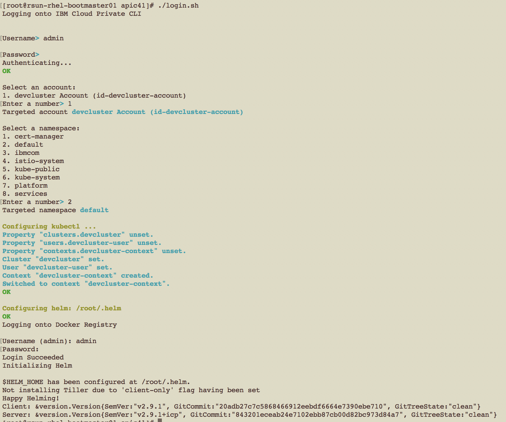


### 3. Setup API Connect Install

**Step #1**  The script [setup.sh](./apic-install/apic/setup.sh) can be run to setup artifacts in IBM Cloud Private

The contents of the script [setup.sh](./apic-install/apic/setup.sh) is as follows: 

```
#
# UPDATE VARIABLES TO MATCH THE ENVIRONMENT
#

# Define cluster information
CLUSTER_NAME=mycluster.icp
CLUSTER_ADMIN=admin
CLUSTER_PWD=XXXX
CLUSTER_EMAIL=admin@DOMAIN_NAME

# Create namespace
kubectl create namespace apiconnect
kubectl apply -f apiconnect-user.yaml -n apiconnect 

# Create secrets
kubectl create secret docker-registry apiconnect-icp-secret --docker-server=$CLUSTER_NAME:8500 --docker-username=$CLUSTER_ADMIN --docker-password=$CLUSTER_PWD --docker-email=$CLUSTER_EMAIL --namespace apiconnect
```

**Note:**  The script should be updated to include the correct values for *CLUSTER_NAME*, *CLUSTER_ADMIN*, *CLUSTER_PWD* and *CLUSTER_EMAIL*.

The screen shot having the output of the aforesaid commands is listed below.


**Step #2**  The script [createProject.sh](./apic-install/apic/createProject.sh) can be run to setup sandbox to trigger Install Assist commands. 

The contents of the script [createProject.sh](./apic-install/apic/createProject.sh) is as follows: 

```
#
# UPDATE VARIABLES TO MATCH THE ENVIRONMENT
#
PROJECT_NAME=apic41dev

apicup version

mkdir ./$PROJECT_NAME
apicup init $PROJECT_NAME
echo 
```

**Note:**  The script should be updated to include the correct values for *PROJECT_NAME*.

The screen shot having the output of the aforesaid script is listed below.


**Step #3**  The script [login.sh](./apic-install/login.sh) can be run to logon to the namespace **apiconnect**

The screen shot having the output of the login script is listed below.

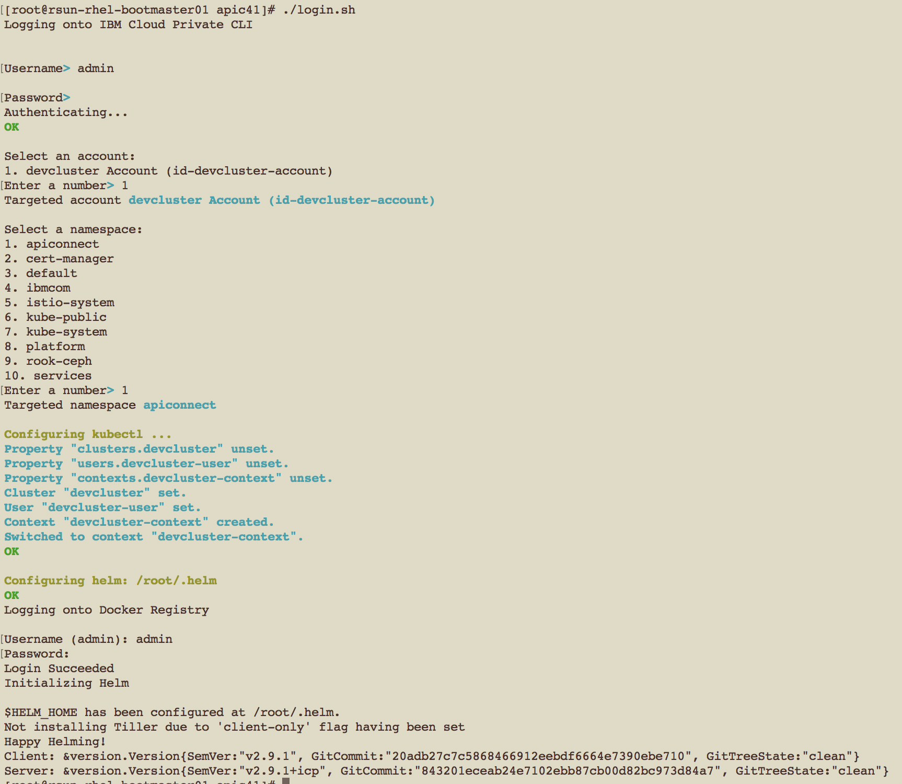


### 4. Load API Connect images

The script [loadimages.sh](./apic-install/apic/loadimages.sh) can be run to load API Connect images

The contents of the script [loadimages.sh](./apic-install/apic/loadimages.sh) is as follows: 

```
#
# UPDATE VARIABLES TO MATCH THE ENVIRONMENT
#

# Define cluster name 
CLUSTER_NAME=mycluster.icp
# Define the location of images 
IMAGE_DIR=/DIRECTORY_HAVING_IMAGES

# Load PPA Archives
cd $IMAGE_DIR
cloudctl catalog load-ppa-archive --archive $IMAGE_DIR/analytics-images-icp.tgz --registry $CLUSTER_NAME:8500
cloudctl catalog load-ppa-archive --archive $IMAGE_DIR/gateway-images-icp.tgz --registry $CLUSTER_NAME:8500
cloudctl catalog load-ppa-archive --archive $IMAGE_DIR/management-images-icp.tgz --registry $CLUSTER_NAME:8500
cloudctl catalog load-ppa-archive --archive $IMAGE_DIR/portal-images-icp.tgz --registry $CLUSTER_NAME:8500
```

**Note:**  The script should be updated to include the correct values for *CLUSTER_NAME* and *IMAGE_DIR*.

Sample log is attached for reference. 

- [management_install.log](./apic-install/samples/images_load.log) 


The following commands can be used to verify if the images are loaded correctly.

```
kubectl get images -n apiconnect
```

The screen shot having the output of the aforesaid commands is listed below.

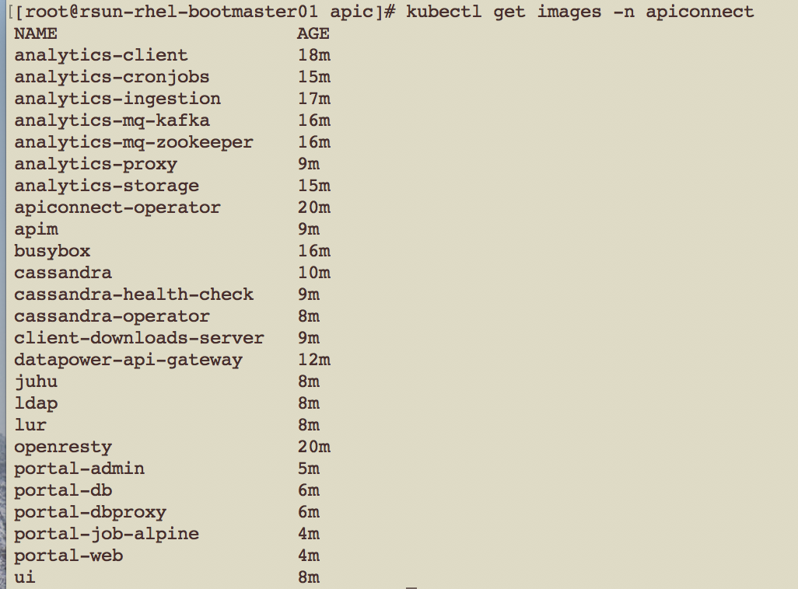

If required, the following utility can be run to delete all the images within the namespace *apiconnect*.

[Delete All Images: deleteImages.sh](./apic-install/utils/deleteImages.sh)


### 5. Install API Connect

**Step #1**  The script [installMgmt.sh](./apic-install/apic/installMgmt.sh) can be run to install API Manager.

The contents of the script [installMgmt.sh](./apic-install/apic/installMgmt.sh) is as follows: 

```
#
# UPDATE VARIABLES TO MATCH THE ENVIRONMENT
#
PROJECT_NAME=apic41dev
APIC_MGMT_ENDPOINT=management.DOMAIN_NAME
CLUSTER_NAME=mycluster.icp
BACKUP_HOST=XXXXX
BACKUP_DIR=/home/XXXX/apicbackup 
FTP_USER=XXXX
FTP_PASS=XXXX

cd ./$PROJECT_NAME

# Setup management subsystem
echo "Set management system properties"
echo 
apicup subsys create mgmt management --k8s
apicup subsys set mgmt create-crd true
apicup subsys set mgmt platform-api   $APIC_MGMT_ENDPOINT
apicup subsys set mgmt api-manager-ui $APIC_MGMT_ENDPOINT
apicup subsys set mgmt cloud-admin-ui $APIC_MGMT_ENDPOINT
apicup subsys set mgmt consumer-api   $APIC_MGMT_ENDPOINT
apicup subsys set mgmt namespace apiconnect
apicup subsys set mgmt registry $CLUSTER_NAME:8500/apiconnect/
apicup subsys set mgmt registry-secret apiconnect-icp-secret
apicup subsys set mgmt cassandra-max-memory-gb 16
apicup subsys set mgmt cassandra-cluster-size 1
apicup subsys set mgmt cassandra-volume-size-gb 16
apicup subsys set mgmt cassandra-backup-host $BACKUP_HOST 
apicup subsys set mgmt cassandra-backup-protocol sftp
apicup subsys set mgmt cassandra-backup-port 22
apicup subsys set mgmt cassandra-backup-path $BACKUP_DIR/cassandra
apicup subsys set mgmt cassandra-backup-auth-user  $FTP_USER
apicup subsys set mgmt cassandra-backup-auth-pass  $FTP_PASS
apicup subsys set mgmt cassandra-backup-schedule "0 0 * * *"
apicup subsys set mgmt cassandra-postmortems-host $BACKUP_HOST 
apicup subsys set mgmt cassandra-postmortems-port 22
apicup subsys set mgmt cassandra-postmortems-path $BACKUP_DIR/cassandra-postmortems
apicup subsys set mgmt cassandra-postmortems-auth-user $FTP_USER
apicup subsys set mgmt cassandra-postmortems-auth-pass $FTP_PASS
apicup subsys set mgmt storage-class rbd-storage-class
apicup subsys set mgmt mode dev

# OPTIONAL: Write the configuration to an output file to inspect apicinstall/apiconnect-up.yaml prior to installation
apicup subsys install mgmt --out mgmt-out --debug
#apicup subsys install mgmt --plan-dir ./$PROJECT_NAME/mgmt-out

# If output file is not used, enter command below to start the installation
apicup subsys install mgmt --debug

cd ..
```

**Note:**  The script should be updated to include the correct values for *PROJECT_NAME*, *APIC_MGMT_ENDPOINT*, *CLUSTER_NAME*, *BACKUP_HOST*, *BACKUP_DIR*, *FTP_USER* and *FTP_PASS*

Sample install Log is attached for reference. 

- [management_install.log](./apic-install/samples/management_install.log) 


**Step #2**  The script [installAnalytics.sh](./apic-install/apic/installAnalytics.sh) can be run to install Analytics.

The contents of the script [installAnalytics.sh](./apic-install/apic/installAnalytics.sh) is as follows: 

```
#
# UPDATE VARIABLES TO MATCH THE ENVIRONMENT
#
PROJECT_NAME=apic41dev
APIC_MGMT_ENDPOINT=management.DOMAIN_NAME
CLUSTER_NAME=mycluster.icp
BACKUP_HOST=XXXXX
BACKUP_DIR=/home/XXXX/apicbackup 
FTP_USER=XXXX
FTP_PASS=XXXX

cd ./$PROJECT_NAME

# Setup management subsystem
echo "Set management system properties"
echo 
apicup subsys create mgmt management --k8s
apicup subsys set mgmt create-crd true
apicup subsys set mgmt platform-api   $APIC_MGMT_ENDPOINT
apicup subsys set mgmt api-manager-ui $APIC_MGMT_ENDPOINT
apicup subsys set mgmt cloud-admin-ui $APIC_MGMT_ENDPOINT
apicup subsys set mgmt consumer-api   $APIC_MGMT_ENDPOINT
apicup subsys set mgmt namespace apiconnect
apicup subsys set mgmt registry $CLUSTER_NAME:8500/apiconnect/
apicup subsys set mgmt registry-secret apiconnect-icp-secret
apicup subsys set mgmt cassandra-max-memory-gb 16
apicup subsys set mgmt cassandra-cluster-size 1
apicup subsys set mgmt cassandra-volume-size-gb 16
apicup subsys set mgmt cassandra-backup-host $BACKUP_HOST 
apicup subsys set mgmt cassandra-backup-protocol sftp
apicup subsys set mgmt cassandra-backup-port 22
apicup subsys set mgmt cassandra-backup-path $BACKUP_DIR/cassandra
apicup subsys set mgmt cassandra-backup-auth-user  $FTP_USER
apicup subsys set mgmt cassandra-backup-auth-pass  $FTP_PASS
apicup subsys set mgmt cassandra-backup-schedule "0 0 * * *"
apicup subsys set mgmt cassandra-postmortems-host $BACKUP_HOST 
apicup subsys set mgmt cassandra-postmortems-port 22
apicup subsys set mgmt cassandra-postmortems-path $BACKUP_DIR/cassandra-postmortems
apicup subsys set mgmt cassandra-postmortems-auth-user $FTP_USER
apicup subsys set mgmt cassandra-postmortems-auth-pass $FTP_PASS
apicup subsys set mgmt storage-class rbd-storage-class
apicup subsys set mgmt mode dev

# OPTIONAL: Write the configuration to an output file to inspect apicinstall/apiconnect-up.yaml prior to installation
apicup subsys install mgmt --out mgmt-out --debug
#apicup subsys install mgmt --plan-dir ./$PROJECT_NAME/mgmt-out

# If output file is not used, enter command below to start the installation
apicup subsys install mgmt --debug

cd ..
```

**Note:**  The script should be updated to include the correct values for *PROJECT_NAME*, *APIC_MGMT_ENDPOINT*, *CLUSTER_NAME*, *BACKUP_HOST*, *BACKUP_DIR*, *FTP_USER* and *FTP_PASS*

Sample install Log is attached for reference. 

- [analytics_install.log](./apic-install/samples/analytics_install.log) 


**Step #3**  The script [installGateway.sh](./apic-install/apic/installGateway.sh) can be run to install Gateway.

The contents of the script [installGateway.sh](./apic-install/apic/installGateway.sh) is as follows: 

```
#
# UPDATE VARIABLES TO MATCH THE ENVIRONMENT
#
PROJECT_NAME=apic41dev
GATEWAY_ENDPOINT=gateway.DOMAIN_NAME
GATEWAY_DIRECTOR_ENDPOINT=gateway-director.DOMAIN_NAME
CLUSTER_NAME=mycluster.icp

cd ./$PROJECT_NAME
 
# Setup gateway subsystem
echo "Set gateway system properties"
echo
apicup subsys create gwy gateway --k8s
apicup subsys set gwy api-gateway $GATEWAY_ENDPOINT 
apicup subsys set gwy apic-gw-service $GATEWAY_DIRECTOR_ENDPOINT
apicup subsys set gwy namespace apiconnect
apicup subsys set gwy registry-secret apiconnect-icp-secret
apicup subsys set gwy image-repository ibmcom/datapower
apicup subsys set gwy image-tag "latest"
apicup subsys set gwy image-pull-policy Always
apicup subsys set gwy replica-count 3
apicup subsys set gwy max-cpu 4
apicup subsys set gwy max-memory-gb 6
apicup subsys set gwy storage-class rbd-storage-class
apicup subsys set gwy v5-compatibility-mode true 
apicup subsys set gwy enable-tms false
apicup subsys set gwy mode dev

#OPTIONAL: Write the configuration to an output file to inspect apicinstall/apiconnect-up.yaml prior to installation
apicup subsys install gwy --out gwy-out  --debug 
#apicup subsys install gwy --plan-dir gwy-out  --debug

#If output file is not used, enter command below to start the installation
apicup subsys install gwy  --debug

cd ..
```

**Note:**  The script should be updated to include the correct values for *PROJECT_NAME*, *GATEWAY_ENDPOINT*, *GATEWAY_DIRECTOR_ENDPOINT* and *CLUSTER_NAME*.

Sample install Log is attached for reference. 

- [gateway_install.log](./apic-install/samples/gateway_install.log) 


**Step #4**  The script [installPortal.sh](./apic-install/apic/installPortal.sh) can be run to install Portal.

The contents of the script [installPortal.sh](./apic-install/apic/installPortal.sh) is as follows: 

```
#
# UPDATE VARIABLES TO MATCH THE ENVIRONMENT
#
PROJECT_NAME=apic41dev
PORTAL_ADMIN_ENDPOINT=portal-admin.DOMAIN_NAME
PORTAL_ENDPOINT=portal.DOMAIN_NAME
CLUSTER_NAME=mycluster.icp
BACKUP_HOST=XXXXXX
BACKUP_DIR=/home/XXXXX/apicbackup 
FTP_USER=XXXXX
FTP_PASS=XXXXX

cd ./$PROJECT_NAME

# Setup Portal subsystem
echo "Set portal system properties"
echo
apicup subsys create ptl portal --k8s
apicup subsys set ptl portal-admin $PORTAL_ADMIN_ENDPOINT
apicup subsys set ptl portal-www $PORTAL_ENDPOINT
apicup subsys set ptl namespace apiconnect
apicup subsys set ptl registry $CLUSTER_NAME:8500/apiconnect
apicup subsys set ptl registry-secret apiconnect-icp-secret 
apicup subsys set ptl storage-class rbd-storage-class
apicup subsys set ptl www-storage-size-gb 5
apicup subsys set ptl backup-storage-size-gb 5
apicup subsys set ptl db-storage-size-gb 12
apicup subsys set ptl db-logs-storage-size-gb 2
apicup subsys set ptl admin-storage-size-gb 1
apicup subsys set ptl site-backup-host $BACKUP_HOST 
apicup subsys set ptl site-backup-port 22
apicup subsys set ptl site-backup-path $BACKUP_DIR
apicup subsys set ptl site-backup-auth-user $FTP_USER
apicup subsys set ptl site-backup-auth-pass $FTP_PASS
apicup subsys set ptl site-backup-path $BACKUP_DIR
apicup subsys set ptl site-backup-protocol sftp
apicup subsys set ptl site-backup-schedule "0 2 * * *"
apicup subsys set ptl mode dev

# OPTIONAL: Write the configuration to an output file to inspect apicinstall/apiconnect-up.yaml prior to installation
apicup subsys install ptl --out ptl-out  --debug 
#apicup subsys install ptl --plan-dir ptl-out  --debug

# If output file is not used, enter command below to start the installation
apicup subsys install ptl  --debug

cd ..
```

**Note:**  The script should be updated to include the correct values for *PROJECT_NAME*, *PORTAL_ADMIN_ENDPOINT*, *PORTAL_ENDPOINT*, *CLUSTER_NAME*, *BACKUP_HOST*, *BACKUP_DIR*, *FTP_USER* and *FTP_PASS*.


### 6. Verify API Connect Install

The following command can be used to get all the pods and their states. It will be good to analyze the pods that are NOT in the Running state. If all the pods are not in the *Running* state, the [Troubleshooting tips section](#12-troubleshooting-api-connect-install) can be referred.

~~~
kubectl get pods -n apiconnect
~~~


The following command can be used to get the details of storage classes used in the system.

~~~
kubectl get sc -n apiconnect
~~~


The following command can be used to get the details of Persistant Storage Volumes used in the system.

~~~
kubectl get pvc -n apiconnect
~~~


The following commands can be used to get details of the current API Connect setup.

~~~
kubectl get services -n apiconnect
~~~


The following command can be used to get the list of installed Helm Charts. IBM API Connect should be listed if it was successfully installed.

~~~
helm list --tls
~~~

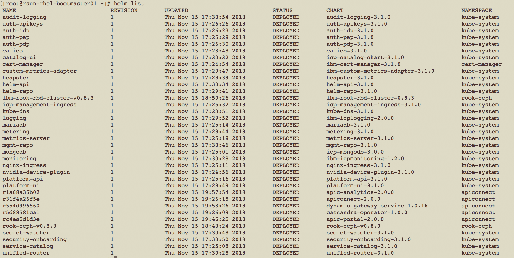


### 7. Troubleshooting API Connect Install

This section can be used as reference if there are issues when deploying IBM API Connect Helm chart.

The following command can be used to get more details about the failing pod.

~~~
kubectl -n apiconnect describe pods <failing_pod_name>
kubectl -n apiconnect logs <failing_pod_name>
~~~

The following command can be used to get more details about the failing *Persistent Storage Volume* that are NOT bound.

~~~
kubectl -n apiconnect describe pvc <pending_pvc>
~~~

If required, the following command can be used to delete the Helm chart and reinstall the IBM API Connect.

~~~
helm delete --purge <old_helm_release>
~~~


### 8. Install and Configure SMTP.

**Note:** This task is NOT required if an SMTP server is already available.

If SMTP server is NOT available, the following steps can be executed on the Management node to enable **FakeSMTP** as the reference SMTP server.

The following link has details on the SMTP Server setup.

http://nilhcem.com/FakeSMTP/download.html

Also, the following commands can be run to download *java* and install on the Redhat systems.

~~~
yum install java-1.7.0-openjdk-devel
~~~

The following commands are run to enable FakeSMTP after the utility is downloaded.

~~~
mkdir /tmp/emails
java -jar fakeSMTP-1.13.jar -s -b -p 2525 -o /tmp/emails &
~~~


### 9. Login to the Cloud Manager

The login URL is:

https://APIC_MGMT_ENDPOINT/admin/

The credentials user name `admin` and password `7iron-hide` can be used to login to API Connect cloud manager.

The screen shot of the home page after logging onto the IBM API Connect Cloud Manager is used is listed below.

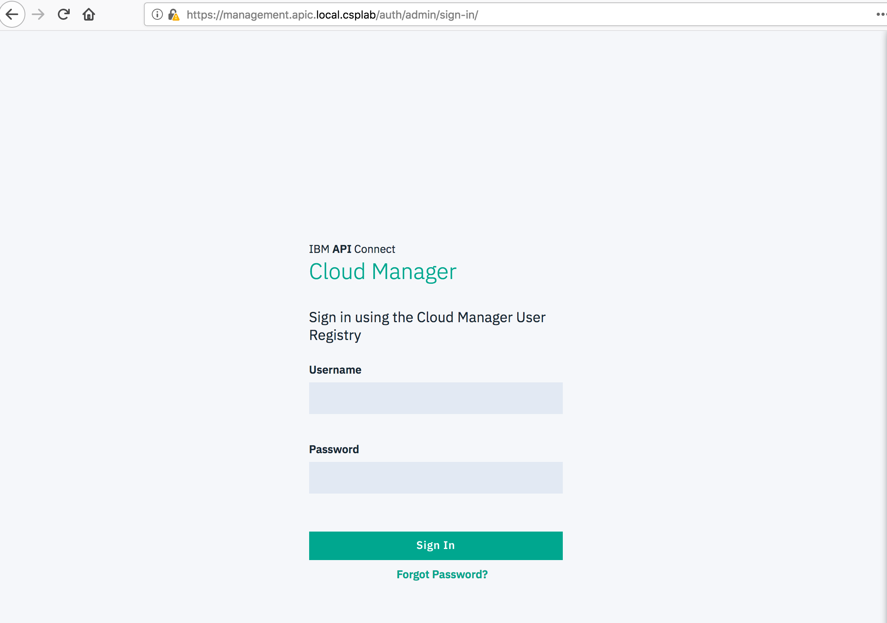

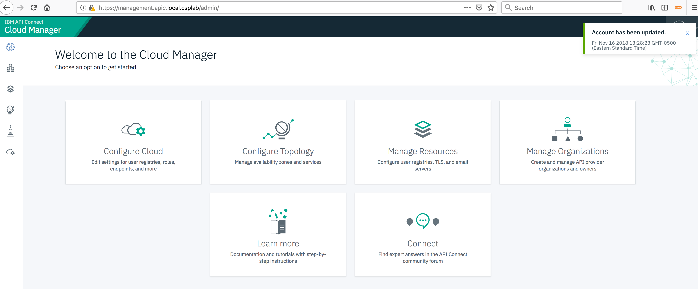

#### 9.1 Configure eMail server

The following link can be used as a reference to setup the eMail server:

- [Configuring an email server for notifications](https://www.ibm.com/support/knowledgecenter/en/SSMNED_2018/com.ibm.apic.cmc.doc/config_emailserver.html)

The screen shot having values used in the current setup is listed below.

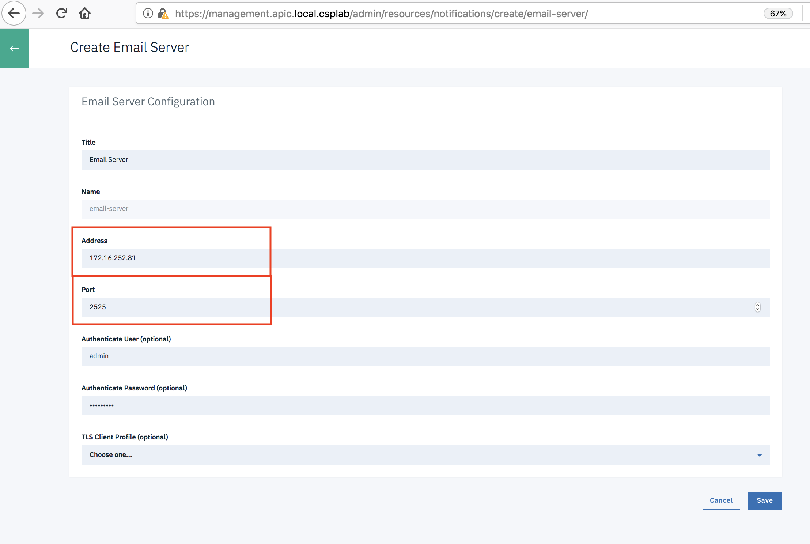

The following link can be used as reference to configure the *Notification*.

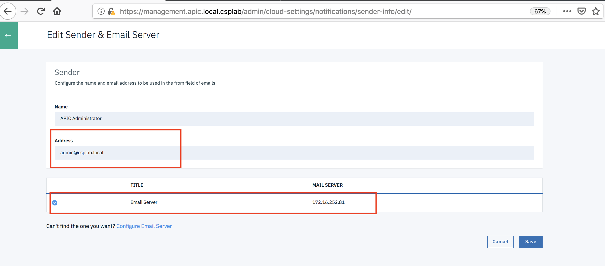

- [Configuring notifications](https://www.ibm.com/support/knowledgecenter/en/SSMNED_2018/com.ibm.apic.cmc.doc/task_cmc_config_notifications.html)

#### 9.2 Register Gateway service

The following link can be used as reference to set up Gateway Service:

- [Registering a gateway service](https://www.ibm.com/support/knowledgecenter/en/SSMNED_2018/com.ibm.apic.cmc.doc/config_gateway.html)

The value of **API Endpoint Base** can be set to the value used in the parameter *GATEWAY_ENDPOINT* in the script [installGateway.sh](./apic-install/apic/installGateway.sh)

The value of **Endpoint** can be set to the value *"https://<DYNAMIC_GATEWAY_SERVICE_INGRESS_NAME>.<NAMESPACE>.svc:3000"*.

**Note:** DYNAMIC_GATEWAY_SERVICE_INGRESS_NAME can be retrieved using the output of the following command:

~~~
kubectl get services -n apiconnect | grep dynamic-gateway-service-ingress | awk -F' ' '{print $1 }'
~~~

The screen shot having values used in the current setup is listed below.

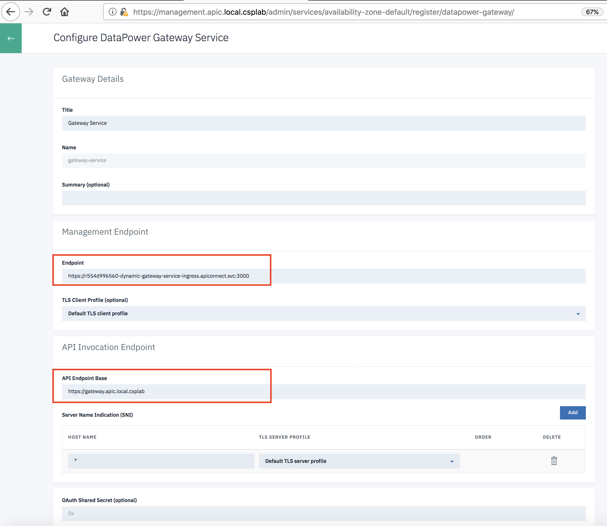

#### 9.3 Register Analytics service

The following link can be used as reference to set up Analytics Service:

- [Registering an analytics service](https://www.ibm.com/support/knowledgecenter/en/SSMNED_2018/com.ibm.apic.cmc.doc/config_analytics.html)

The value of **Endpoint** can be set to the value used in the parameter *ANALYTICS_CLIENT_ENDPOINT* in the script [installAnalytics.sh](./apic-install/apic/installAnalytics.sh)

The default *TLS Analytics Client* profile can be chosen.

The screen shot having values used in the current setup is listed below.

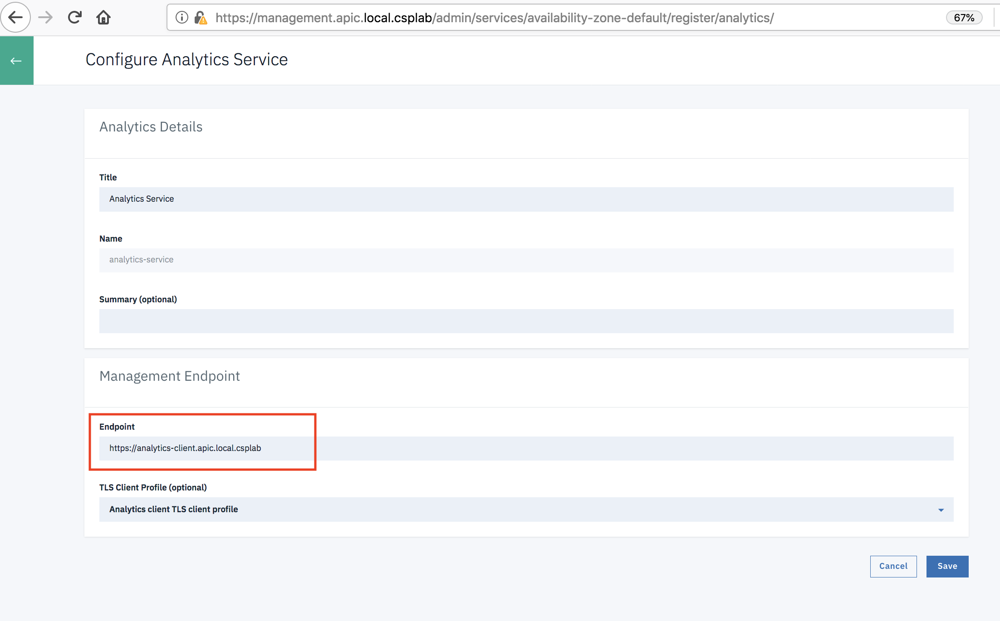


#### 9.4 Register Portal service

The following link can be used as reference to set up Portal Service:

- [Registering a portal service](https://www.ibm.com/support/knowledgecenter/en/SSMNED_2018/com.ibm.apic.cmc.doc/config_portal.html)

The value of **Web Endpoint** can be set to the value used in the the parameter *PORTAL_ENDPOINT* in the script [installPortal.sh](./apic-install/apic/installPortal.sh)

The value of **Director Endpoint** can be set to the value used in the parameter the parameter *PORTAL_ADMIN_ENDPOINT* in the script [installPortal.sh](./apic-install/apic/installPortal.sh)

The screen shot having values used in the current setup is listed below.

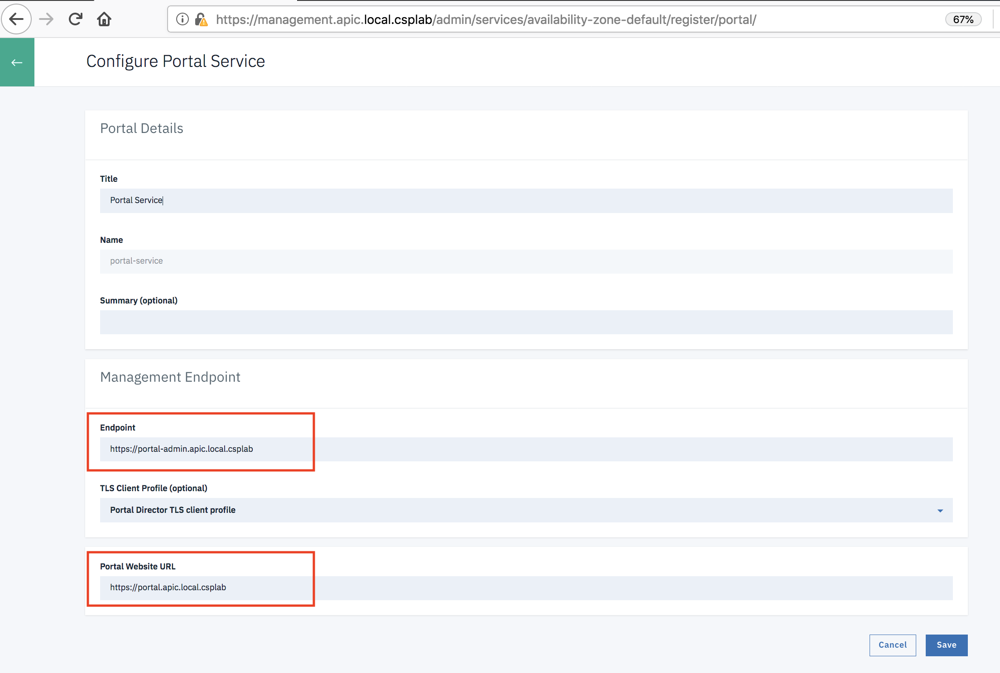


#### 9.5 Create Provider Organization

The following link can be used as a reference to setup a Provider Organization. Option #2 listed in the link can be used to invite the new Organization owner.

- [Creating a provider organization account](https://www.ibm.com/support/knowledgecenter/en/SSMNED_2018/com.ibm.apic.cmc.doc/create_organization.html)

The screen shot having activation link is listed below.


### 10. Login to the API Manager

The Activation link received in the previous section can be used to register the new Provider Organization and logon to API Manager.

The screen shot of the home page after the activation link is used is listed below.

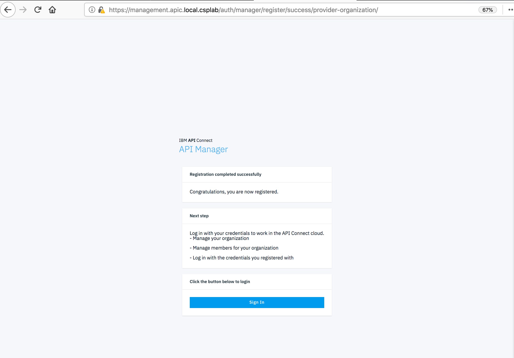


#### 10.1 Configure Default Gateway for the sandbox catalog

The following link can be used as a reference to configure the Gateway for the sandbox catalog.

- [Configuring default gateway services for catalogs](https://www.ibm.com/support/knowledgecenter/en/SSMNED_2018/com.ibm.apic.cmc.doc/task_cmc_config_catalogDefaults.html)

The screen shot having default gateway is listed below.


#### 10.2 Import API and Product

**Note:** Sample API [hello_1.0.1.yaml](./samples/hello_1.0.1.yaml) and the Product [samples_1.0.1.yaml](./samples/samples_1.0.1.yaml) can be used for the import.

The following link can be used as a reference to import API and Product.

- [Importing an API](https://www.ibm.com/support/knowledgecenter/en/SSMNED_2018/com.ibm.apic.apionprem.doc/tutorial_apionprem_import_api.html)

- [Importing an Product](https://www.ibm.com/support/knowledgecenter/en/SSMNED_2018/com.ibm.apic.apionprem.doc/task_apionprem_upload_product.html)

The screen shots after the import is listed below.

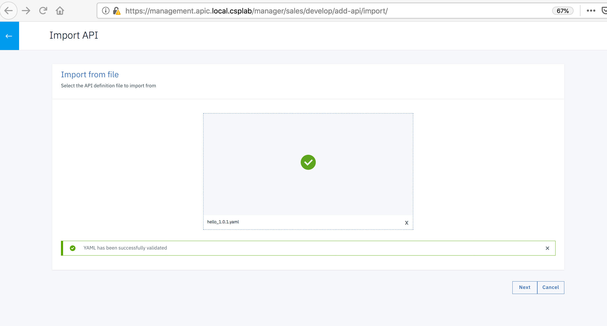


#### 10.3 Publish Product

The following links can be used as a reference to publish an API.

- [Publish a Product](https://www.ibm.com/support/knowledgecenter/en/SSMNED_2018/com.ibm.apic.apionprem.doc/task_publishing_a_product.html)

The screen shot after the publish is listed below.


#### 10.4 Test the APIs

After the API is published, the API can be tested from the Assembly and/or by invoking the URL directly.

Results are attached below.

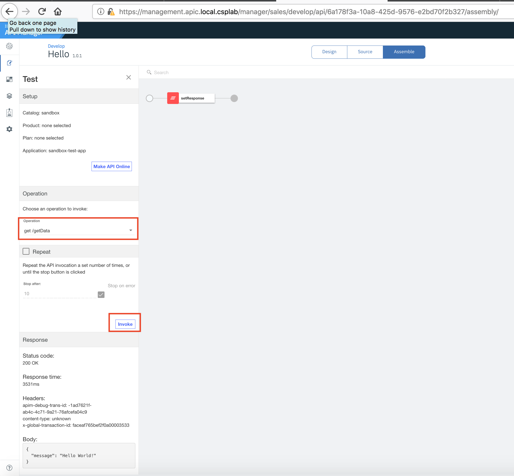


#### 10.5 Create Portal Site

The following link can be used as a reference to create Developer Portal.

- [Creating and configuring Catalogs](https://www.ibm.com/support/knowledgecenter/en/SSMNED_2018/com.ibm.apic.apionprem.doc/create_env.html)

The screen shots after the creation of Portal is listed below.

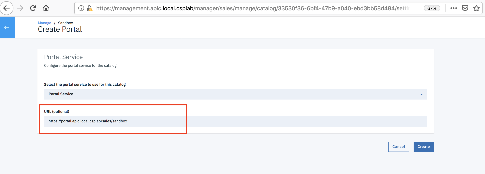


#### 10.6 Create Consumer Organization

The following link can be used as a reference to create Consumer Organization using the "Create Organization" flow.

- [Creating Consumer Organization ](https://www.ibm.com/support/knowledgecenter/en/SSMNED_2018/com.ibm.apic.apionprem.doc/task_apionprem_create_organization.html)

The screen shot after the creation of Consumer Organization is listed below.

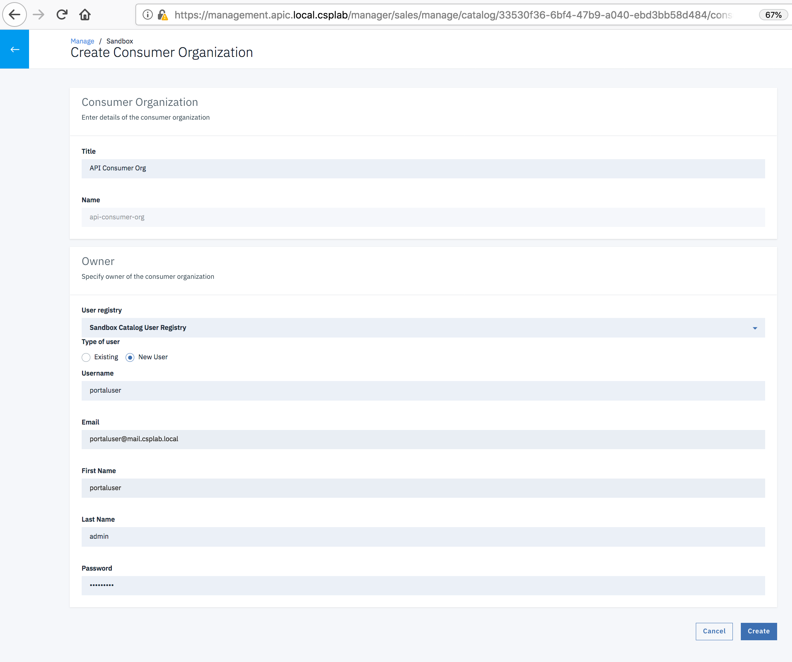


### 11. Login to the Developer Portal

The login URL is:

https://PORTAL_ENDPOINT/PROVIDER_ORG_SHORT_NAME/CATALAG_NAME

The credentials of the Consumer Org owner created in the previous section can be be used to login to the Developer Portal. The screen shot of the home page after logging onto the IBM API Connect Cloud Manager is used is listed below.

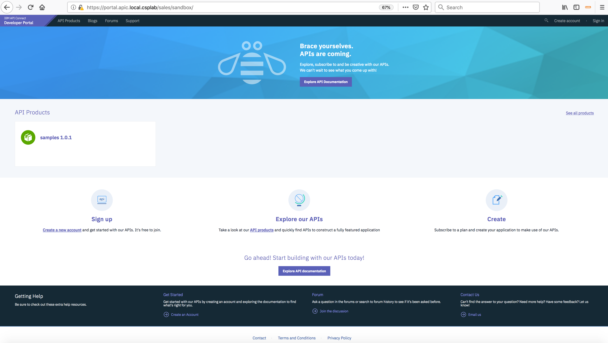

The screen shot after the successful login is listed below.

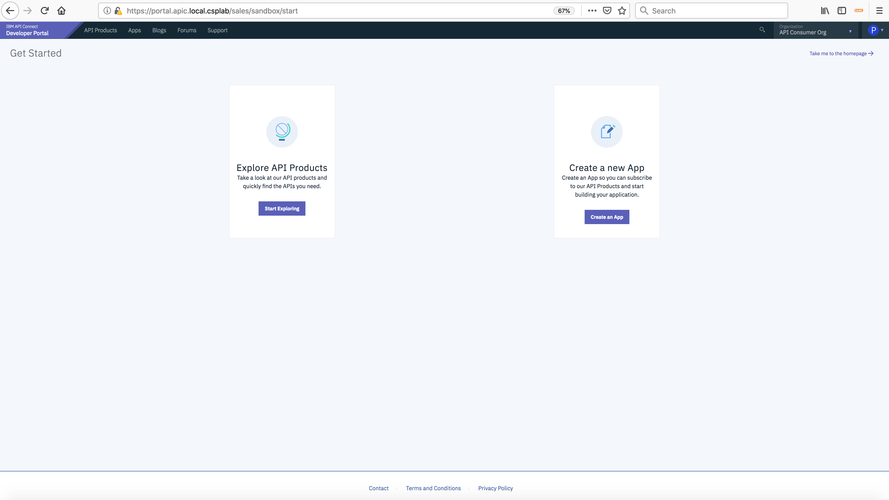


## References

The following links can be used as reference:

- [Requirements for deploying API Connect into a Kubernetes runtime environment](https://www.ibm.com/support/knowledgecenter/en/SSMNED_2018/com.ibm.apic.install.doc/tapic_install_reqs_Kubernetes.html)
- [Installing API Connect into a Kubernetes runtime environment](https://www.ibm.com/support/knowledgecenter/SSMNED_2018/com.ibm.apic.install.doc/tapic_install_Kubernetes_overview.html)
